<p align="right">
   <a href="./README.md">EN</a> | <a href="./README.zh-CN.md">简</a> | <strong>繁</strong> | <a href="./README.ko.md">KO</a> | <a href="./README.ja.md">JA</a>
</p>
<div align="center">
    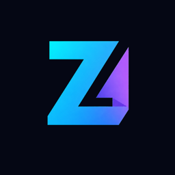
    <h1>ZT Monitor</h1>
</div>

<p align="center">
    <em>跨裝置聚合每個 AI 編程工具的即時用量。</em>
</p>

<p align="center">
    <a href="https://github.com/zneoxlab/ztoken-monitor/releases"></a>
    <a href="https://github.com/zneoxlab/ztoken-monitor/releases"></a>
    
    
    
    <a href="https://discord.gg/HmdNVVvw5P"></a>
    <a href="LICENSE"></a>
</p>

<div align="center">
    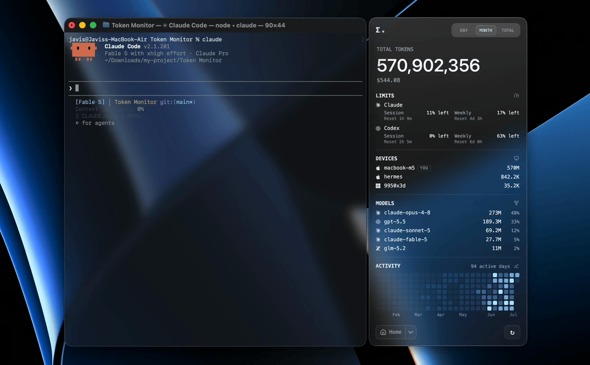
</div>

## 什麼是 ZT Monitor？

一款桌面小工具，即時顯示 Claude Code、Codex、Cursor、GitHub Copilot 等 30+ 種 AI 編程工具的 Token 用量與 AI 工具額度，具備即時多裝置同步與歷史使用趨勢功能，並支援依工具、裝置、模型、session 或專案分項顯示。

## 鳴謝與致敬

ZT Monitor 是 [Token Monitor](https://github.com/Javis603/token-monitor)（由 [Javis](https://github.com/Javis603) 開發的開源專案）的衍生版本。我們感謝原作者與開源社群的基礎工作，使 ZT Monitor 得以實現。ZT Monitor 沿用與原專案相同的 MIT 授權條款。

## ZT Monitor 的新增內容

ZT Monitor 在原 Token Monitor 基礎上增加了以下內容：

- **雲端 Hub（SaaS）支援** —— 多租戶雲端 hub 模式，支援帳號註冊/登入，跨網路的裝置無需自建 hub 即可同步。預設雲端 hub 位址為 `https://token-hub.zneox.com`，可自訂。
- **品牌識別** —— 在小工具、系統匣與文件中啟用新的 logo 與產品名（ZT Monitor）。
- **可設定的更新來源** —— 透過 `TOKEN_MONITOR_UPDATE_REPO` 環境變數將更新檢查指向你自己的 GitHub 儲存庫（見 `.env.example`）。
- 上游的全部功能——多裝置同步、AI 工具額度、工作階段保留、趨勢、匯出、Discord Rich Presence——均保留。

## 支援的工具

ZT Monitor 對 Token 用量、帳戶額度與 session 明細分別支援：

| Logo | 工具 | 資料路徑 | Token 用量 | AI 工具額度 | session 明細 |
|:---:|------|-----------|:---:|:---:|:---:|
| 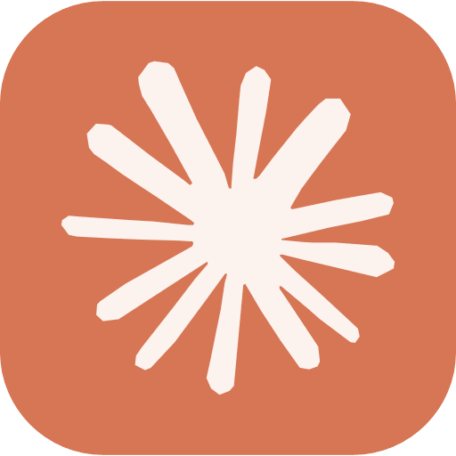 | Claude Code | `~/.claude/projects/`、`~/.claude/transcripts/` | ✅ | ✅ | ✅ |
|  | Codex | `~/.codex/sessions/` | ✅ | ✅ | ✅ |
|  | OpenCode | `~/.local/share/opencode/` | ✅ | ✅ | ✅ |
|  | Hermes Agent | `$HERMES_HOME/state.db` 或 `~/.hermes/state.db` | ✅ | — | — |
|  | OpenClaw | `~/.openclaw/agents/` | ✅ | — | — |
|  | Cursor | `~/.config/tokscale/cursor-cache/`（由 Cursor 同步保持更新） | ✅ | ✅ | — |
|  | Antigravity | `~/.config/tokscale/antigravity-cache/`（由 Antigravity 同步保持更新） | ✅ | ✅ | — |
|  | Cline | VS Code globalStorage tasks（`.../saoudrizwan.claude-dev/tasks/`） | ✅ | — | — |
|  | Kimi CLI / Kimi Code | `~/.kimi/sessions/`、`~/.kimi-code/sessions/`（`KIMI_CODE_HOME`）；Kimi Code API 金鑰（透過 Kimi API 查詢 Kimi Code 額度） | ✅ | ✅ | — |
|  | Qwen CLI | `~/.qwen/projects/` | ✅ | — | — |
|  | Grok Build | `$GROK_HOME/sessions/` 或 `~/.grok/sessions/` | ✅ | ✅ | — |
| 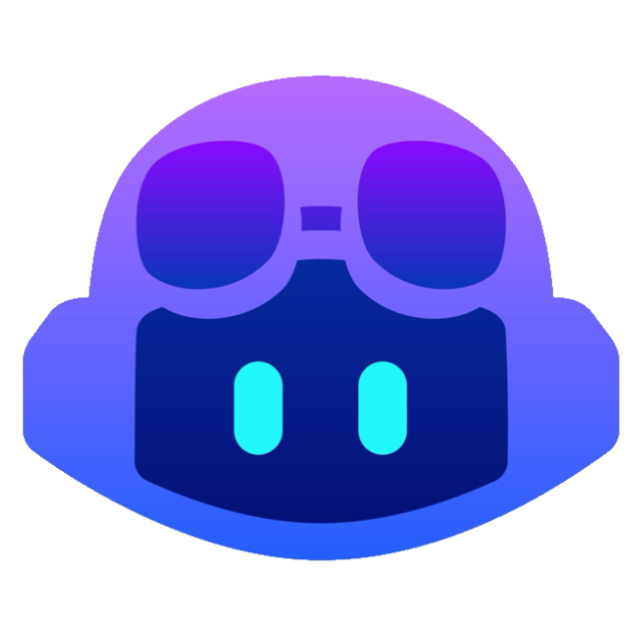 | GitHub Copilot | VS Code `workspaceStorage/*/chatSessions/`、`~/.copilot/otel/` | ✅ | ✅ | — |
|  | Pi | `~/.pi/agent/sessions/`、`~/.omp/agent/sessions/`（Oh My Pi） | ✅ | — | — |
|  | Zed | `~/.local/share/zed/threads/threads.db` | ✅ | — | — |
| 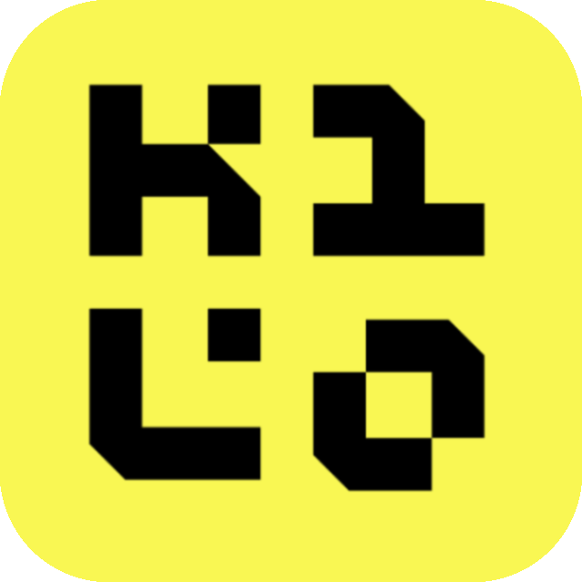 | Kilo Code | VS Code globalStorage tasks（`.../kilocode.kilo-code/tasks/`）—— 僅 Linux 與遠端/WSL | ✅ | — | — |
|  | MiMo Code | `~/.local/share/mimocode/mimocode.db` | ✅ | ✅ | — |
|  | ZCode / GLM | `~/.zcode/projects/`；Z.ai API 金鑰（透過 Z.ai API 查詢 GLM 個人/團隊 Coding Plan 額度） | ✅ | ✅ | — |
|  | Kiro | `~/.kiro/sessions/cli/`、Kiro IDE globalStorage 與 `kiro-cli` 資料庫 | ✅ | ✅ | — |
|  | CodeBuddy | `~/.codebuddy/projects/` 與 IDE / VS Code 擴充套件日誌 | ✅ | — | — |
|  | WorkBuddy | `~/.workbuddy/projects/`、`~/.workbuddy/workbuddy.db` | ✅ | — | — |
|  | Proma | `~/.proma/agent-sessions/*.jsonl` | ✅ | — | — |
|  | Reasonix | `~/.reasonix/` (`stats/`, `sessions/`, `projects/*/sessions/`) | ✅ | — | — |
|  | DeepSeek Harness | `$DSH_HOME/sessions/` or `~/.dsh/sessions/` (`<cwd>/<session>/session.jsonl.zstd`) | ✅ | — | — |
| 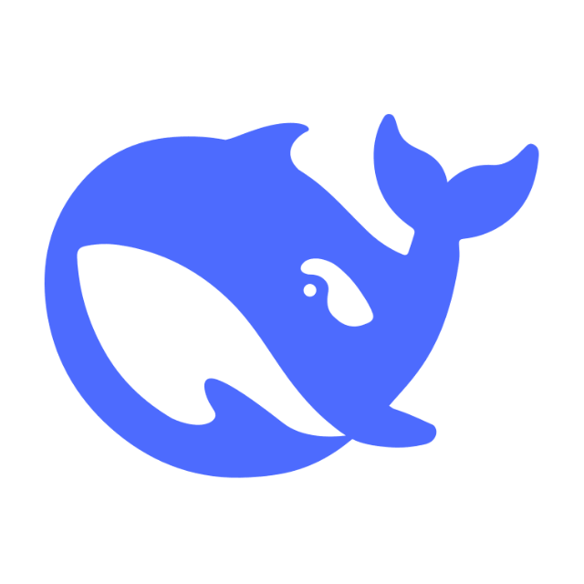 | DeepSeek | DeepSeek API 金鑰（透過 DeepSeek API 查詢餘額） | — | ✅ | — |
| 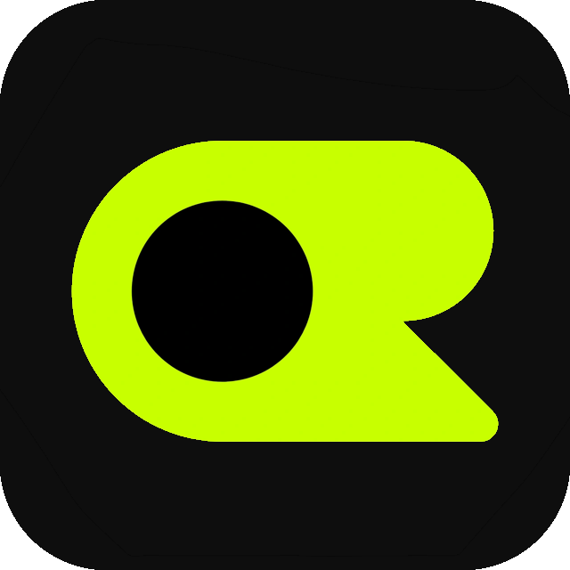 | OpenRouter | OpenRouter API 金鑰（查詢用量／金鑰上限；獲授權存取 credits 時顯示餘額，官方文件指定 Management 金鑰） | — | ✅ | — |
|  | Minimax | Minimax API 金鑰（透過 Minimax API 查詢 Token Plan 額度） | — | ✅ | — |
|  | Volcengine | Ark API key 或火山引擎 AK/SK（透過火山引擎 API 查詢火山方舟 Coding Plan 額度） | — | ✅ | — |
| 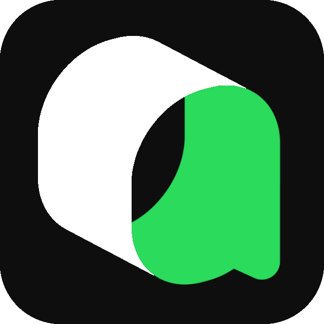 | Qoder | Qoder dashboard cookie（透過 Qoder usage API 查詢 big-model credits） | — | ✅ | — |
| 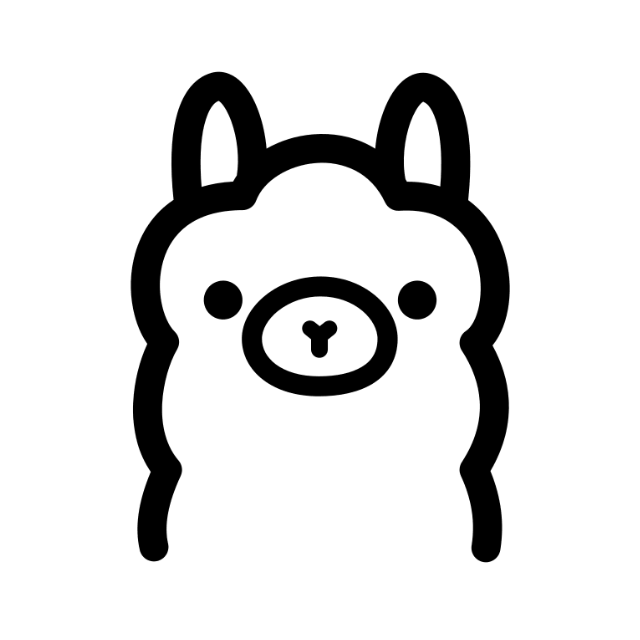 | Ollama | Ollama Cloud cookie（透過 ollama.com/settings 查詢 session／每週用量） | — | ✅ | — |
| 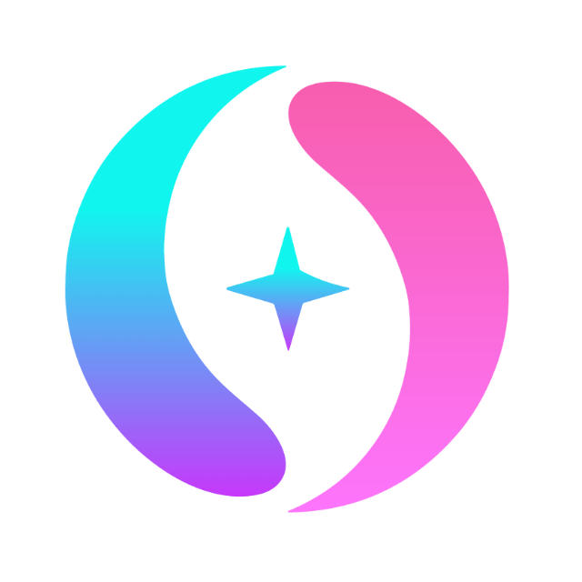 | 第三方 API | New API 相容帳戶預設方案（包括相容的 One API 分支）、New API 金鑰預設方案與宣告式自訂餘額端點 | — | ✅ | — |

Custom 會從一個 GET 餘額端點映射數值 JSON 欄位；僅相容 OpenAI 或 Anthropic API 並不足夠。

## 介面展示

<table>
<tr>
<td width="290" align="center">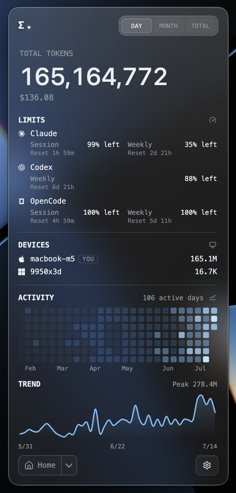<br><sub>可自訂儀表板：自選要顯示的模組與排序</sub></td>
<td width="290" align="center">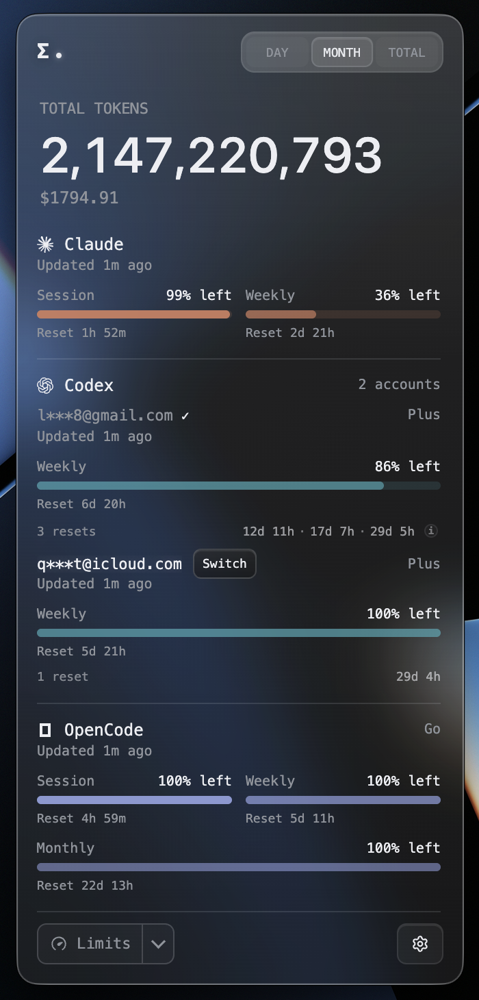<br><sub>多帳號並列，Codex 可一鍵切換本機帳號</sub></td>
<td width="290" align="center">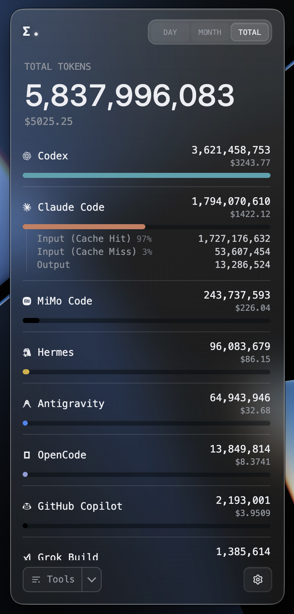<br><sub>點任一工具展開輸入／輸出與快取命中明細</sub></td>
</tr>
<tr>
<td width="290" align="center">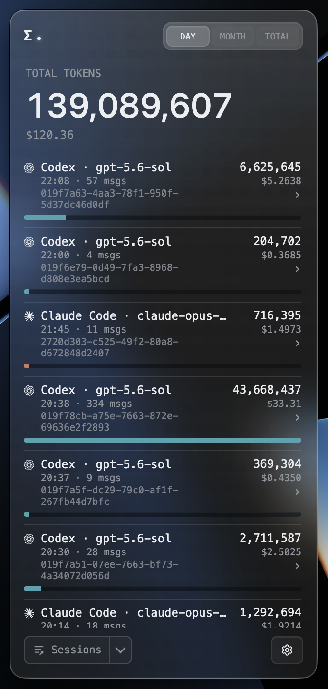<br><sub>點進單一 session，逐則提問拆解 token 與用到的工具</sub></td>
<td width="290" align="center">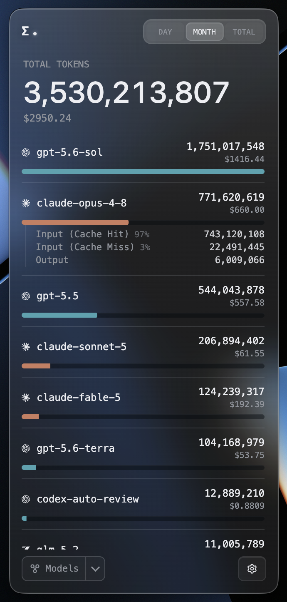<br><sub>跨工具彙總每個模型的用量與成本</sub></td>
<td width="290" align="center">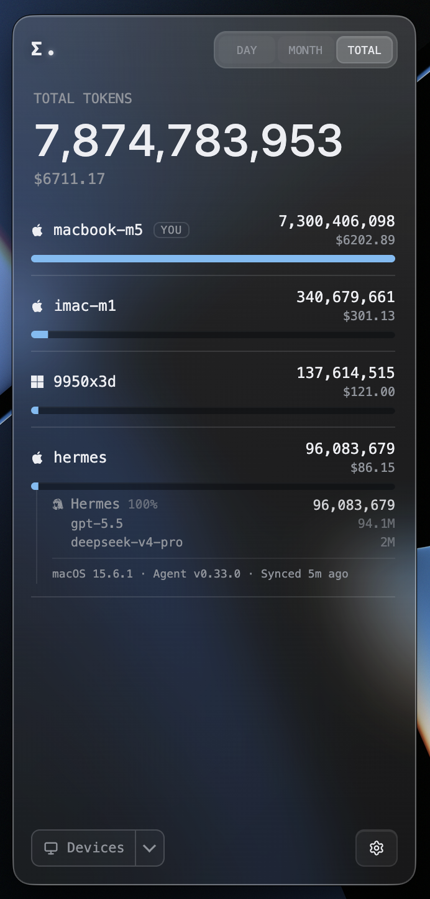<br><sub>每台裝置的用量、成本與同步狀態，可展開看單機明細</sub></td>
</tr>
</table>

<table>
<tr>
<td width="435" align="center">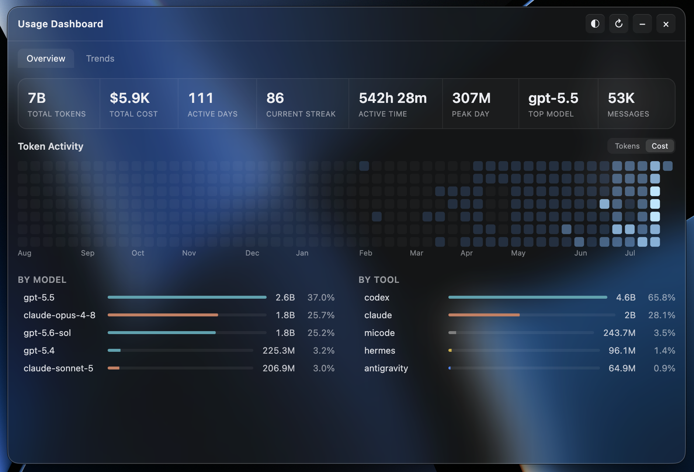<br><sub>跨所有裝置彙總的一年活躍熱力圖與連續天數</sub></td>
<td width="435" align="center">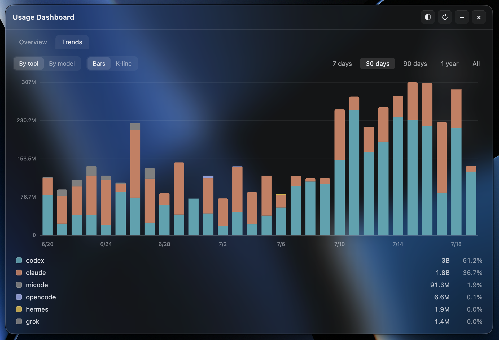<br><sub>一年份每日趨勢，依工具／模型堆疊，含 K 線</sub></td>
</tr>
</table>

## 為什麼要用 ZT Monitor？

大多數用量監控工具只在它執行的那台機器上有用。ZT Monitor 是為多裝置工作流而設計的：每台裝置監看自己的本機紀錄、把摘要更新送到你的 hub，每個連線中的小工具幾乎都能即時看到 Token 變化。

## 功能特色

### 用量追蹤

- **即時 Token 追蹤**：Claude Code、Codex、Cursor、GitHub Copilot、Antigravity、OpenCode 等 23+ 種 AI 工具，每輪對話後 UI 在數秒內更新（完整清單見上方表格）
- **單一 session 明細**：點進 Claude Code、Codex 或 OpenCode 的 session，可看每則提問的 Token 消耗，並展開查看每次回覆的 Token 拆分與用到的工具（開啟時才即時讀取本機 transcript 或資料庫，絕不同步）
- **快取命中統計**：點擊任何工具或模型，展開查看輸入 Token（快取命中與未命中）、輸出 Token 的詳細分類及命中率百分比
- **成本與幣別**：Token 數量旁附帶成本；可用 USD、TWD、HKD 或 CNY 顯示，匯率每日自動更新，也可在設定中手動覆寫
- **WSL 用量（Windows）**：執行中 WSL 發行版裡的檔案型用量會自動偵測，約每 5 分鐘併入總量；OpenCode、Hermes 等 SQLite 來源可能需要依照[指南](docs/wsl-sqlite-setup.zh-CN.md)在 WSL 內執行 headless agent

### 額度、趨勢與匯出

- **AI 工具額度偵測**：涵蓋 Claude Code、Codex、Cursor、OpenRouter、第三方 API、GLM、Kimi 等 18+ 家供應商的 session、每週、帳單與 credits 視窗，支援多個 OpenRouter／第三方 profile，以及 DeepSeek 預付餘額與消費
- **多帳號與 Codex 帳號切換**：同一供應商可追蹤多個帳號、各自顯示額度；已加入追蹤的 Codex 帳號還能一鍵切換為本機使用帳號，免重新登入授權
- **保留已刪除會話用量**：許多工具會定期清除舊 session（Claude Code 預設清 30 天前的 transcript），一刪就再也算不到。開啟後，ZT Monitor 會在本機不設期限地封存已觀測到的每日工具／模型用量，讓熱力圖與趨勢即使在來源檔案被清掉後仍然完整（詳見下方[〈會話資料保留期〉](#會話資料保留期)）
- **使用趨勢與儀表板**：主頁的活躍熱力圖與趨勢圖，加上獨立的儀表板視窗，提供連續天數，以及跨所有裝置、依工具／依模型堆疊的歷史（柱狀圖與 K 線兩種檢視）
- **可選的狀態檢視**：追蹤 Claude、OpenAI、Cursor 與 DeepSeek status 頁，支援手動或定時重新檢查
- **資料匯出**：把使用資料匯出成與工具無關的 CSV + JSON，可手動或自動寫入資料夾，接試算表、Obsidian、Grafana 或自寫腳本；詳見 [docs/export.md](docs/export.md)
- **訂閱資料**：手動記錄每個 AI 帳號的實際費用；方案標籤的 tooltip 會顯示費用、下次續費或到期日、已訂閱時間，以及本月用量成本相對訂閱費的回本倍數，定期方案與儲值紀錄皆適用

### 多裝置與部署

- **多裝置即時同步**：透過 Server-Sent Events 推送，一台裝置的更新數秒內出現在其他裝置
- **本地優先**：單裝置使用完全不需伺服器
- **自架同步後端**：小工具內 hub、Node CLI hub 或 Cloudflare Worker，任你選
- **iOS 小工具支援**：透過 Worker hub 搭配 Widgy、Scriptable
- **隱私優先**：提示詞、回應、原始碼與檔案內容都留在你的機器上

### 介面與呈現

- **分組檢視**：可依工具、裝置、模型、session、專案或帳戶額度分組查看用量
- **選單列（macOS）與系統匣（Windows）彈出視窗**：圖示旁可顯示成本、token 數，或最接近用完的供應商剩餘額度百分比
- **懸浮小窗模式**：可將小工具收成可拖曳的緊湊小窗，支援點擊或懸停預覽展開，並可顯示托盤同款內容
- **選單列排版自訂**：選單列與懸浮小窗的顯示內容可以直接挑內建版型，也可以選「自訂…」自己排——加入 AI 工具圖示、額度條、百分比、重置時間、成本或自訂文字等項目，拖曳排序並即時預覽，每個項目還能各自指定 AI 工具、帳號、額度週期與字型
- **外觀控制**：介面主題切換（含淺色模式）、各工具廠商色、玻璃透明度、模糊度、完全透明視窗
- **工具列表自訂**：可隱藏、置頂和拖曳排序主列表中的工具，不影響實際追蹤
- **可錄製全域快捷鍵**：可從任何地方快速顯示或隱藏視窗
- **Discord Rich Presence**：將今日 Token、花費與主要工具廣播到你的 Discord 個人檔案（需手動開啟）

## 安裝

從 [GitHub Releases](https://github.com/zneoxlab/ztoken-monitor/releases) 下載。

- **macOS（Apple Silicon）** — `.dmg`，已簽章並 notarize
- **macOS（Intel）** — x64 `.dmg`，已簽章並 notarize
- **Windows 10/11** — 安裝版與可攜版 `.exe`
- **Linux x64** — `.AppImage`

打包版會自動檢查 GitHub Releases。有新版本時，介面會顯示更新提示；支援的平台也可在 設定 → 一般 中安裝更新。

### 首次啟動

本地模式是預設模式：啟動 App 後會開始追蹤這台裝置。不需要 hub、代理或設定。

## 多裝置同步

挑一個所有裝置（與任何無頭代理）都連得到的 hub 後端。在每台裝置上打開小工具，在 設定 → 多裝置同步 選一個模式。小工具會自動回報本機用量；只在沒有小工具的機器上跑 `npm run agent`。

#### 選項 A——直接在小工具內開 hub（最簡單，無需命令列）

在一台持續開機的機器上打開小工具，進入 設定 → 多裝置同步，選 **在這台裝置架設 Hub**。小工具會產生隨機 secret，並列出其他裝置可連入的區網 URL（Tailscale 或 ZeroTier 位址也會顯示在這裡）。在其他每台裝置上選 **連接到 Hub**，把 URL 與 secret 貼進去即可。

只要 ZT Monitor 還在跑，hub 就會運作——結束 App（僅關閉視窗不算）會停掉 hub，所有連入的裝置都會中斷。

#### 選項 B——自架 Node hub（持續開機的無頭機器）

```bash
# 在會持續開機的機器上
cp .env.example .env
# 把 TOKEN_MONITOR_SECRET 設成你私有的值，然後：
npm run hub
```

#### 選項 C——Cloudflare Worker hub（跨網路，包括 iPhone）

[](https://deploy.workers.cloudflare.com/?url=https://github.com/zneoxlab/ztoken-monitor/tree/main/worker)

一鍵部署——Cloudflare 會在過程中請你輸入 `TOKEN_MONITOR_SECRET`。或手動部署：

```bash
cd worker
npm install
npx wrangler login
npx wrangler secret put TOKEN_MONITOR_SECRET
npx wrangler deploy
```

把部署 URL 貼到每台裝置的小工具 設定 → 多裝置同步。iOS 小工具設定步驟與端點參考請見 [worker/README.md](worker/README.md)，hub HTTP API 請見 [docs/API.md](docs/API.md)。

## App 資料

App 狀態存在 OS 使用者資料目錄——解除安裝時一併刪除該資料夾即可完整移除。

| 平台 | 路徑 |
|------|------|
| macOS | `~/Library/Application Support/Token Monitor/` |
| Windows | `%APPDATA%/Token Monitor/` |
| Linux | `~/.config/Token Monitor/` |

## 從原始碼建置

如需自己從原始碼打包安裝檔，請在**對應的**作業系統上使用 Node.js 22.13+（electron-builder 無法在 Windows 上交叉建置 macOS 的 `.dmg`，反之亦然）。

```bash
npm install
npm run dist:mac     # macOS arm64 .dmg → dist/
npm run dist:mac:x64 # macOS Intel x64 .dmg → dist/
npm run dist:win     # Windows x64 安裝檔 .exe → dist/
npm run dist:linux   # Linux x64 AppImage → dist/
npm run pack         # 未封裝的 app 目錄（無安裝檔），方便本機快速測試
```

產物會放在 `dist/`。Windows 和 Linux 請在對應系統上使用上面的 `dist:*` 腳本。如果要打包 macOS 發布版，需要本機有 Developer ID Application 簽章身份；本機開發或未列出的平台請用 `npm start` 啟動。

## 運作原理

```text
模式 A——本地（預設，免設定）
    小工具 (Electron) ──▶ tokscale ──▶ ~/.claude、~/.codex、$HERMES_HOME

模式 B——同步（選用，多裝置）
    裝置 A agent ──▶
    裝置 B agent ──▶  hub  ──▶  任一裝置上的小工具
    裝置 C agent ──▶
```

小工具會根據 設定 → 多裝置同步 決定走本地或同步模式。hub 本身可以是獨立的 `npm run hub` 程序、Cloudflare Worker，或直接跑在某一個小工具裡（Host 模式）。同步模式下，hub 透過 Server-Sent Events 把彙總後的統計推送給每個連線中的小工具，所以一台裝置上的更新會在數秒內出現在其他裝置上。

## 會話資料保留期

開啟**保留已刪除會話用量**（設定 → 採集）後，ZT Monitor 會在本機不設期限地封存已觀測到的每日工具／模型用量——即使來源工具日後清掉 session，熱力圖與趨勢也不受影響。

<details>
<summary><strong>進階：延長來源工具本身的保留期</strong></summary>

<br>

熱力圖與同步資料採 370 天的滾動視窗（更舊的觀測資料仍留在本機供日後檢視）。**Claude Code 預設只保留 30 天的 transcript**（`cleanupPeriodDays`）；若想在封存啟用前就保住完整的滾動年份，請在時限過去之前於 `~/.claude/settings.json` 調高：

```json
{
  "cleanupPeriodDays": 370
}
```

設更大能留更多，代價是 transcript 會依你設定的期限一直留在磁碟上。其他工具的預設值與設定檔路徑，請見 tokscale 的 [Session Data Retention](https://github.com/junhoyeo/tokscale#session-data-retention) 表。

這份封存只涵蓋 ZT Monitor 已觀測過的日期；在它開始追蹤之前就被刪除的資料無法補回。

</details>

## 設定

設定分兩處，日常使用只需要前者：

- **小工具（GUI）**——點右下角的 `⚙` 開啟，分區依序為：一般（語言、登入啟動、更新）、主畫面（首頁模組與顯示幣別）、視窗（視窗行為、選單列與懸浮小窗排版、托盤模式、快捷鍵）、外觀（主題與廠商色）、採集（追蹤的工具、採集頻率、保留已刪除會話用量、資料匯出）、AI 工具額度（供應商選擇、額度與憑證）、訂閱資料（每個帳號實際付多少）、多裝置同步。標題列的 `⇧` 鈕可循環切換視窗行為。
- **無頭代理與 hub**——沒有 UI，用專案根目錄的 `.env` 設定（從 `.env.example` 複製）；優先序為 CLI 旗標 → 環境變數 → 內建預設。

每一項設定與所有環境變數的完整說明，請見[設定參考文件](docs/configuration.md)。

## 隱私

ZT Monitor 會在本機處理使用紀錄，不會向專案維護者傳送分析或遙測資料。網路存取僅用於文件中說明或由使用者啟用的功能；更新、供應商整合、Discord Rich Presence 與可選多裝置同步所使用的資料，請參閱[隱私權政策](docs/privacy.md)。

## Star 歷史

<a href="https://www.star-history.com/?repos=zneoxlab%2Fztoken-monitor&type=date&legend=top-left">
 <picture>
   <source media="(prefers-color-scheme: dark)" srcset="https://api.star-history.com/chart?repos=zneoxlab/ztoken-monitor&type=date&theme=dark&legend=top-left&sealed_token=VEcaPQSNlH8coYjuILJy7eT6t-pGJrGDEjOAjVwP8WGwNBOeNXoLTcz-KVBaZ2Y8eSqG1tLEpWGF3-5eMvVhW5G8n1ckdYI_uMZ6UCBE7b_eANd6we__7g7yc4ShXemuWfi-8SRcxgJNLK12VZGgBIccY1ceI3T3xm7jBM1TJjTVQFWJ0MmX2e-7QBp9" />
   <source media="(prefers-color-scheme: light)" srcset="https://api.star-history.com/chart?repos=zneoxlab/ztoken-monitor&type=date&legend=top-left&sealed_token=VEcaPQSNlH8coYjuILJy7eT6t-pGJrGDEjOAjVwP8WGwNBOeNXoLTcz-KVBaZ2Y8eSqG1tLEpWGF3-5eMvVhW5G8n1ckdYI_uMZ6UCBE7b_eANd6we__7g7yc4ShXemuWfi-8SRcxgJNLK12VZGgBIccY1ceI3T3xm7jBM1TJjTVQFWJ0MmX2e-7QBp9" />
   
 </picture>
</a>

## 參與貢獻

歡迎提交 Issue 和 PR。專案規範、架構說明和指令參考都在 [AGENTS.md](AGENTS.md) 中——它是為編碼代理撰寫的，但同樣可以作為貢獻者指南。

## 致謝

- [tokscale](https://github.com/junhoyeo/tokscale) 提供紀錄解析與 Token 計算。
- [CodexBar](https://github.com/steipete/CodexBar) 提供 AI 工具額度的研究參考。
## 授權

[MIT](LICENSE) © [@Javis](https://github.com/Javis603) & zneox
